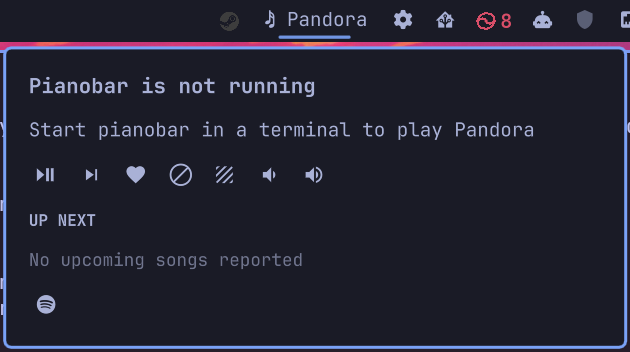

# Pianobar Pandora Widget for Omarchy Bar

Play Pandora from the Omarchy Quattro bar. The widget starts and manages pianobar in a detached session with no visible terminal. At rest the bar shows only a music note. During playback it slowly scrolls the artist and song title. Left click opens the player dropdown; right click opens widget settings.



## Install

```sh
omarchy plugin add https://github.com/nicholasladwig/omarchy-pianobar-pandora-widget.git --enable
```

The widget needs Python 3, which is part of a normal Omarchy installation, plus `pianobar`, `tmux`, and `libsecret` (which provides `secret-tool`). The plugin reports missing packages in its dropdown. Install those dependencies with your normal system package manager, then reopen the widget. Omarchy's plugin installer clones and enables this plugin without requesting elevation or changing system packages.

To update an existing installation:

```sh
omarchy plugin update io.github.nicholasladwig.pianobar-pandora-widget
```

See [CHANGELOG.md](CHANGELOG.md) for release history.

To reinstall from a clean plugin checkout:

```sh
omarchy plugin remove io.github.nicholasladwig.pianobar-pandora-widget --yes
omarchy plugin add https://github.com/nicholasladwig/omarchy-pianobar-pandora-widget.git --enable --yes
```

Removing the plugin does not remove your pianobar configuration or saved Secret Service password.

## First use

1. Install the required system packages if the dropdown reports any missing dependencies. Then left click the music note to open the dropdown.
2. Click the account icon, enter your Pandora username and password, review the config changes, check the consent box, and click the check mark. This saves the password in the desktop Secret Service and starts pianobar without opening a terminal.
3. If pianobar asks for an initial station, open the station list in the dropdown and select one. Later starts use pianobar's existing station configuration.

After you check the consent box and save your account, the plugin creates the control FIFO and sets `user`, `password_command`, `fifo`, and `event_command` in `~/.config/pianobar/config`. It preserves unrelated pianobar settings. Clicking Play later does not change the config. If that config already has a different `event_command`, setup stops with an error so you can arrange a wrapper for both hooks; it does not silently discard the previous hook. An existing plaintext `password` line is removed when you save an account through the widget.

The widget does not auto-start on login. Click Play in the dropdown when you want to start it. Click Stop there to end the managed session. The detached session remains running when the dropdown closes.

## Controls and settings

- Bar: music note only while idle; music note and slowly scrolling artist and title while playing. Left click opens or closes the player dropdown. Middle click pauses or resumes. Right click opens settings.
- Player dropdown: After initial account setup, it keeps only playback controls, including Play/Pause (which starts the managed player when stopped), next, love, ban, tired of song for a month, volume down or up, elapsed/remaining/total time, upcoming tracks, and station selection. Each action briefly uses the same wording as its player action, such as “Loving song” or “Banning song”; errors remain visible in the panel. Use Edit Account to change the saved login. Remove Account requires a second click, clears the Secret Service password and login settings, then stops the managed player. Select the highlighted **STATIONS** text button to open or close the station list. The widget handles account setup and playback without a terminal.
- Stations and Advanced: the highlighted **STATIONS** and **ADVANCED** controls sit side by side. Opening one closes the other. Advanced opens the command view inside the dropdown, which shows pianobar's own output and accepts its normal command keys or prompt answers. The help button sends `?`; Up, Down, Enter, and Escape controls handle menu navigation. When a password prompt is detected, every Advanced input control is disabled. The local helper also checks the live prompt immediately before it accepts or sends text, so a refresh delay cannot forward a password. Use Edit Account to save the password through Secret Service instead.
- Right-click settings: adjust the minimum playing label width from 120 to 500 px, and separately show or hide elapsed, remaining, and total time on the bar. Elapsed and remaining are enabled by default. The player dropdown always shows elapsed, remaining, and total for the current track. The bar expands if needed to fit enabled clocks. These settings persist in Omarchy's bar configuration.

Times are estimated from pianobar's song start and duration events. Pausing through the widget freezes the estimate. Network stalls or playback changes made outside the widget may briefly make it inaccurate until the next song event.

The quick controls read pianobar's configured `act_*` key bindings and fall back to its defaults. Pianobar's FIFO accepts keypresses, not semantic commands. The Advanced view passes text literally to the managed pianobar session, never through a shell. It is available only while the widget-managed session is running.

All player-panel colors use the active Omarchy bar theme. Changing the Omarchy
theme updates the widget's text, controls, input fields, hover states, and
error or destructive-action color without changing widget settings.

## Data and security

The password is stored through `secret-tool` in your session's Secret Service collection. Pianobar's `password_command` retrieves it when pianobar starts. The username and other pianobar settings are in `~/.config/pianobar/config` with mode `0600` after account setup. Account setup stops without modifying an existing config that cannot be read. The event bridge writes only song, station, and timing metadata to `$XDG_CACHE_HOME/io.github.nicholasladwig.pianobar-pandora-widget/state.json` (or `~/.cache/...`) with user-only permissions. The plugin never sends account data anywhere except to pianobar and the local Secret Service.

The plugin runs with your user permissions inside the Omarchy shell. Review the source before installation. It uses the normal pianobar process for Pandora traffic. Installation and normal operation do not request elevation or change system packages.

## Troubleshooting

```sh
omarchy plugin validate ~/.config/omarchy/plugins/io.github.nicholasladwig.pianobar-pandora-widget
omarchy plugin list --json
python3 ~/.config/omarchy/plugins/io.github.nicholasladwig.pianobar-pandora-widget/bridge.py status
qs log -p "$OMARCHY_PATH/shell" --tail 100
```

If Play does not start music, check for an error in the dropdown and choose a station if one is requested. If you previously started pianobar elsewhere, close that process before starting the widget-managed session. A second player can attach to the same control FIFO, so controls can reach the other process; keep one player running. If the secret store is locked, unlock it in your desktop session before saving the account or starting pianobar.

## Remove

```sh
omarchy plugin remove io.github.nicholasladwig.pianobar-pandora-widget
```

Before removal, use the player dropdown's Remove Account action if you want to clear the saved login. It requires a second click, stops the managed player, removes `user`, `password`, and `password_command` from `~/.config/pianobar/config`, and clears the Secret Service entry. Then remove the plugin's `event_command` and `fifo` lines from `~/.config/pianobar/config` if you do not want them retained. Keep the FIFO if another tool uses it. Do not delete your whole pianobar config.

## Development and publication

```sh
omarchy plugin validate .
qmllint -I "$OMARCHY_PATH/shell" BarWidget.qml Panel.qml
python3 -m py_compile bridge.py
```

The repository's `preview.png` shows the widget during Pandora playback, including the scrolling now-playing label, playback controls, upcoming tracks, and status message.

The [Omarchy development guide](https://plugins.omarchy.org/develop.html) defines the Quattro bar widget contract. The [publishing guide](https://plugins.omarchy.org/publish.html) requires a public GitHub repository and a valid manifest. The plugin's [marketplace submission](https://github.com/omacom/omarchy-plugin-marketplace/issues/8898) tracks review.

Pianobar's [remote control and event command interface](https://github.com/promyloph/pianobar) supplies the data and controls. Pandora is a trademark of Pandora Media; this project is independent and unaffiliated.
